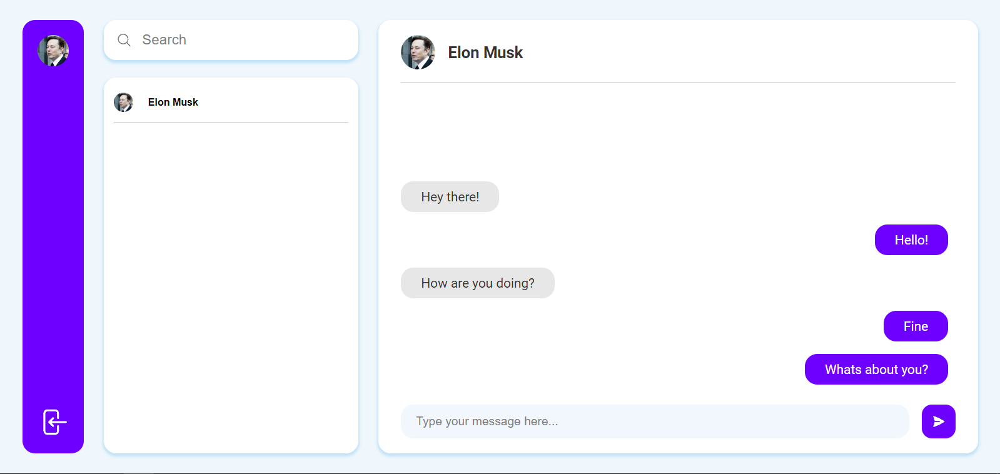

# Chatty

- On Frontend **(TypeScript)**
  - [Vite](https://vitejs.dev)
  - [React](https://react.dev)
  - [React Router](https://reactrouter.com)
  - [Firebase](https://firebase.google.com)
  - [MobX](https://mobx.js.org)
  - [Moment.js](https://momentjs.com)
  - [Sass](https://sass-lang.com)

# 

